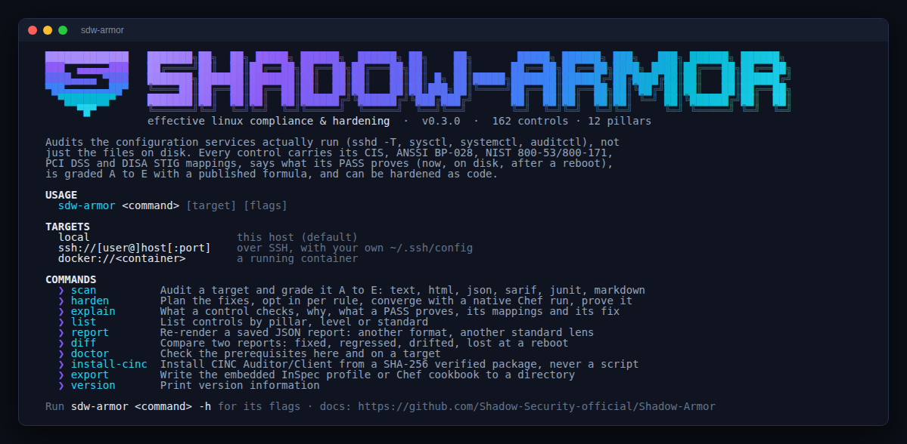
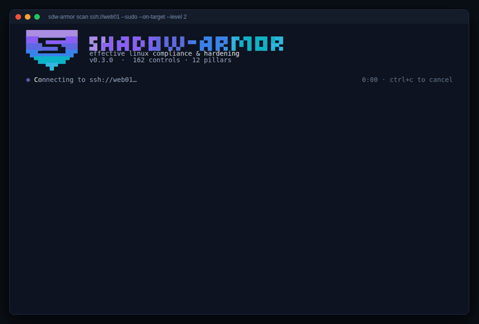
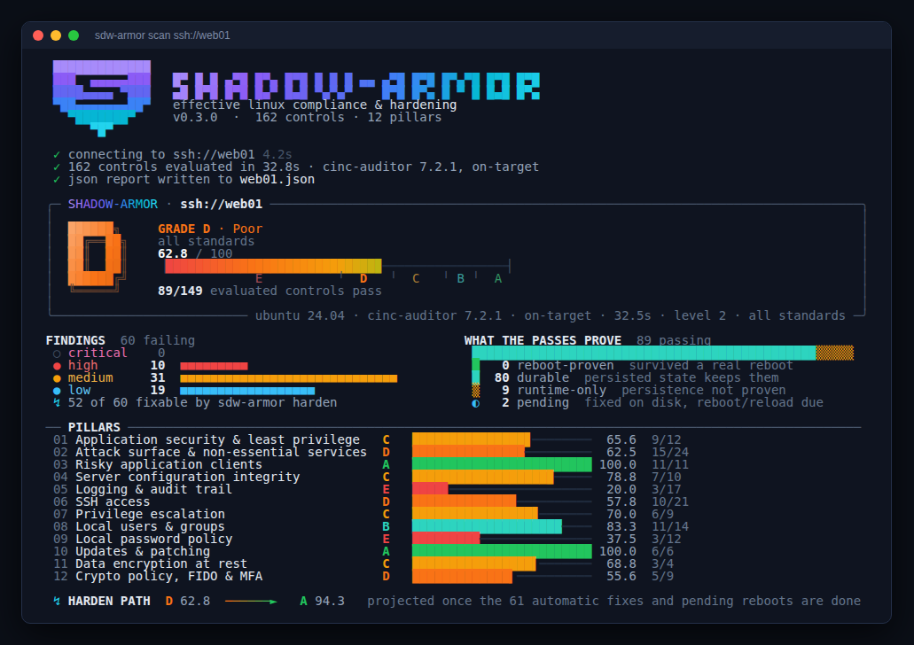
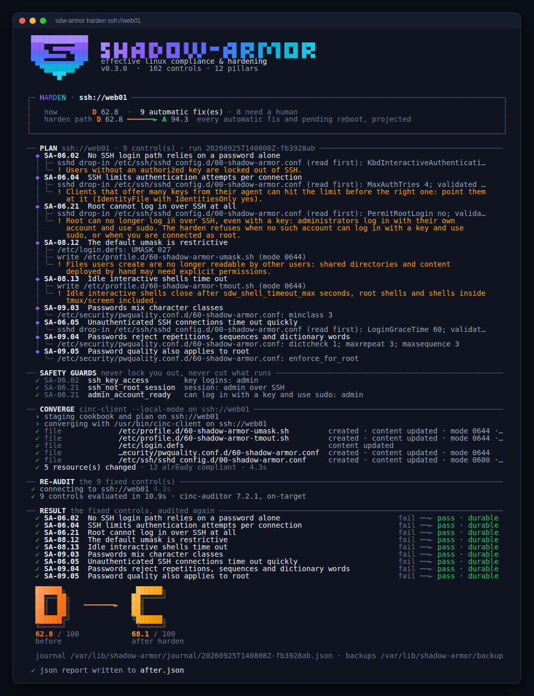
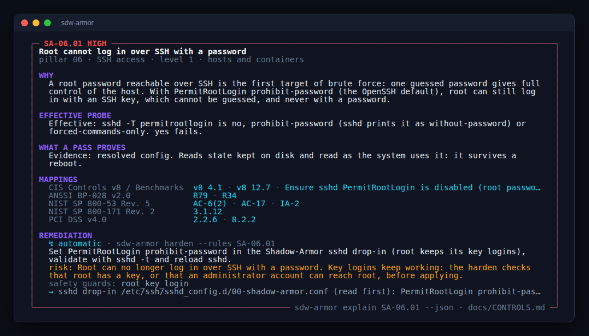
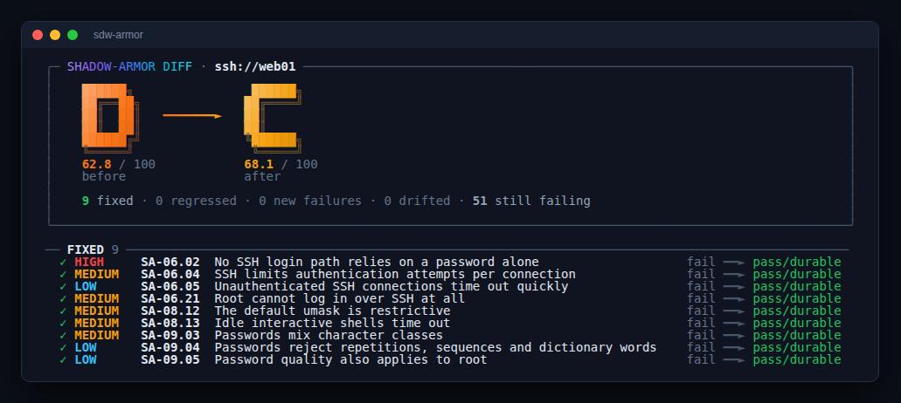

# Shadow-Armor

**Conformité et durcissement Linux sur la configuration effective, avec CINC / InSpec.**

Shadow-Armor audite la configuration que vos services *exécutent réellement* (`sshd -T`, `sysctl`, `systemctl`, `auditctl`), pas seulement le texte des fichiers sur disque. Chaque contrôle porte toutes ses correspondances normatives (CIS, ANSSI BP-028, NIST 800-53 / 800-171, PCI-DSS, DISA STIG), l'hôte reçoit une note de A à E, et le durcissement s'applique « as code ». Un seul binaire statique : `sdw-armor`.

🇬🇧 [English version](README.md)

<p align="center"></p>

<p align="center"></p>

<table>
<tr>
<td width="50%"></td>
<td width="50%"></td>
</tr>
<tr>
<td><b>scan</b> : la note, la preuve derrière, chaque pilier, et la note que <code>harden</code> peut atteindre</td>
<td><b>harden</b> : plan, garde-fous, convergence, ré-audit, la note qui bouge</td>
</tr>
<tr>
<td></td>
<td></td>
</tr>
<tr>
<td><b>explain</b> : pourquoi, comment c'est vérifié, ce que prouve un PASS, toutes les correspondances, la correction</td>
<td><b>diff</b> : corrigé, régressé, dérivé, perdu au redémarrage</td>
</tr>
</table>

## Fonctionnalités

- **La configuration effective, pas les fichiers.** Un contrôle lit l'état résolu : `sshd -T`, valeurs `sysctl` vivantes, `systemctl show`, `auditctl -l`, piles PAM avec tous les `@include` développés, sudoers avec tous les `#includedir`, `modprobe --showconfig`, `systemd-analyze cat-config`. Il voit les `Include` et drop-ins qu'une lecture de fichier rate (un `50-cloud-init.conf` permissif qui annule une configuration principale plus stricte) et **indique le fichier et la ligne qui fixent la valeur effective**.
- **Un contrôle, toutes ses correspondances.** 162 contrôles neutres, chacun avec ses références CIS Controls v8 et CIS Benchmark, ANSSI BP-028 v2.0, NIST SP 800-53 rév. 5 et SP 800-171, PCI DSS v4.0 et DISA SRG.
- **12 piliers de durcissement**, chacun avec sa note (tableau ci-dessous), dont le chiffrement des données au repos et les politiques crypto / FIDO / MFA par OTP.
- **Un verdict qualifié : ce que prouve un PASS.** Chaque verdict porte trois colonnes de preuve, **maintenant · sur disque · après redémarrage**, construites à partir de la nature de l'état lu par chaque assertion (état vivant, configuration de démarrage, configuration résolue, inventaire, fichiers). Un PASS est **durable** ou **runtime-only** (l'état persisté le contredit, ou rien sur disque ne le prouve) ; un FAIL peut être **pending** (déjà corrigé sur disque, en attente d'un redémarrage ou rechargement). La persistance est vérifiée dans le contrôle lui-même partout où elle a une source fiable (sysctl.d, unités activées, modprobe.d, fstab, ligne de commande du noyau, rules.d, pare-feu et MAC au démarrage, lockdown, swap), et un test confronte la nature de preuve déclarée de chaque contrôle à son code. Un A qui repose sur des PASS runtime-only est plafonné à B, et seulement s'il repose dessus : échouer un contrôle ne donne jamais une meilleure note que le réussir.
- **Prouvé par un redémarrage.** Chaque rapport enregistre le démarrage observé. `scan --reboot-baseline avant.json` compare deux scans d'une même machine de part et d'autre d'un vrai redémarrage : ce qui a survécu est **prouvé au redémarrage**, ce qui a disparu est **perdu au redémarrage**. `harden --reboot` enchaîne tout : correction, ré-audit, redémarrage, attente du nouveau démarrage, preuve.
- **Note A:E.** Une [formule publiée](docs/SCORING.md) (pondérée par la sévérité, plafonnée par les contrôles critiques, « fail-closed »), calculée à l'identique par la CLI et le rapport HTML. Une **lentille normative** re-note le même scan à travers un seul référentiel (`--lens anssi`, `--lens pci`...).
- **Le durcissement as code.** `sdw-armor harden` planifie les corrections, vous acceptez règle par règle, des garde-fous écartent toute règle qui vous couperait l'accès ou casserait un service en marche, et une exécution Chef native (`cinc-client --local-mode`) converge des remédiations déclaratives. Les contrôles corrigés sont ensuite **ré-audités**. Dry-run why-run, plans relisables, sauvegarde de chaque fichier modifié, journal de chaque exécution.
- **Rien installé dans votre dos.** `cinc-auditor` s'exécute sur des cibles `local`, `ssh://` ou `docker://` avec votre propre `~/.ssh/config` ; pas d'agent, pas de démon. `--on-target` exige le moteur sur la cible et s'arrête s'il manque. CINC n'est installé que sur demande (`install-cinc`, `--bootstrap-cinc`) : paquet téléchargé sur votre machine, vérifié contre son SHA-256 publié, installé avec `dpkg`/`rpm` ; la cible n'a pas besoin d'Internet, un site isolé fournit son propre paquet.
- **Versions vérifiables.** Binaires statiques, paquets `.deb` et `.rpm`, SBOM CycloneDX (avec l'empreinte du profil et du cookbook embarqués), provenance SLSA et attestation du SBOM, sommes de contrôle signées avec Sigstore. Aucun module Go tiers.
- **Conteneurs.** Les contrôles propres à l'hôte (noyau, chaîne de démarrage, pare-feu, audit) sont « non applicables » dans un conteneur ; paquets, comptes, SSH, sudo, crypto et correctifs restent évalués. `--input sdw_assume_host=true` évalue tout (conteneurs système type LXC).
- **Sorties.** Terminal, rapport HTML autonome hors-ligne, JSON, SARIF (GitHub code scanning), JUnit et Markdown ; `--fail-under C` bloque un pipeline, `sdw-armor diff --fail-on-regression` détecte la dérive entre deux scans.

## Démarrage rapide

```sh
# 1. Télécharger (paquets .deb et .rpm aussi publiés : docs/INSTALL.md)
VERSION=v0.3.1 ; ARCH=amd64
BASE=https://github.com/Shadow-Security-official/Shadow-Armor/releases/download/$VERSION
curl -fsSLO "$BASE/sdw-armor-linux-$ARCH"
curl -fsSLO "$BASE/SHA256SUMS"

# 2. Vérifier : intégrité, puis qui l'a construit (provenance SLSA, gh 2.49 ou plus récent)
sha256sum --ignore-missing --check SHA256SUMS
gh attestation verify "sdw-armor-linux-$ARCH" --repo Shadow-Security-official/Shadow-Armor
sudo install -m 0755 "sdw-armor-linux-$ARCH" /usr/local/bin/sdw-armor

# 3. Le moteur CINC Auditor (dans aucun dépôt de distribution) : paquet vérifié par SHA-256, confirmation demandée
sdw-armor install-cinc --sudo          # --print affiche les mêmes étapes en commandes shell
sdw-armor doctor

# 4. Scanner
sudo sdw-armor scan
sdw-armor scan ssh://admin@web01 --sudo --on-target -o html:web01.html -o json:web01.json
sdw-armor scan --level 2 --lens anssi
sdw-armor scan ssh://web01 --sudo --engine docker    # sans moteur installé : CINC Auditor depuis son image Docker

# 5. Corriger, puis prouver que la correction survit à un redémarrage
sdw-armor install-cinc ssh://web01 --client --sudo
sdw-armor harden ssh://web01 --sudo --from web01.json
sdw-armor harden ssh://web01 --sudo --rules SA-05.04,SA-06.02 --reboot

# 6. Mettre à jour
sdw-armor update          # une version plus récente est-elle publiée ? n'installe rien
sudo sdw-armor upgrade    # télécharge, vérifie (SHA-256, et Sigstore si cosign est installé), installe
```

Avant de converger, `harden` vérifie la cible et écarte toute règle qui vous couperait l'accès (connexion root, mots de passe SSH, su) ou casserait ce qui tourne (pare-feu, routage IP, suppression de paquets) : [docs/HARDENING.md](docs/HARDENING.md).

Installation complète, vérification (signature Sigstore, SBOM), systèmes pris en charge et erreurs courantes : [docs/INSTALL.md](docs/INSTALL.md).

## Les 12 piliers

| # | Règle | Exemples de contrôles |
|---|---|---|
| 01 | Contrôlez la sécurité et limitez les droits applicatifs | SELinux/AppArmor en enforcing, ASLR, ptrace, eBPF, core dumps, sandboxing systemd, NX |
| 02 | Réduisez la surface d'attaque, désactivez les services non essentiels | serveurs hérités, ports en écoute, modules, sysctl réseau, pare-feu deny par défaut, options de /tmp et /dev/shm |
| 03 | Supprimez les clients applicatifs à risque | telnet, rsh, NIS, FTP/TFTP, netcat -e, compilateurs, forwarding agent/X11 du client SSH |
| 04 | Auditez vos configurations serveurs | AIDE et sa planification, permissions des fichiers sensibles, chargeur de démarrage, cron, Secure Boot, lockdown, fichiers world-writable et orphelins |
| 05 | Activez les logs, première étape vers la conformité | journalisation, journal persistant, auditd et ses règles (chargées *et* persistées), audit immuable, envoi distant, synchronisation horaire |
| 06 | Renforcez la sécurité et la configuration des accès SSH | tout depuis `sshd -T`, blocs Match qui relâchent un paramètre, permissions des configurations et clés d'hôte |
| 07 | Contrôlez l'escalade de privilèges | politique sudo effective, NOPASSWD, use_pty, journal sudo, restriction de su, liste blanche setuid |
| 08 | Contrôlez la configuration des utilisateurs et groupes locaux | UID 0, mots de passe vides, comptes système, homes, dot files, comptes dormants, umask, TMOUT |
| 09 | Appliquez une politique de sécurité des mots de passe | pwquality tel que PAM l'applique, historique, verrouillage, hachage *et empreintes réellement stockées*, nullok |
| 10 | Vérifiez les mises à jour applicatives | correctifs de sécurité en attente, fraîcheur des métadonnées, mises à jour automatiques, signatures, redémarrage dû, bibliothèques supprimées encore en mémoire, version en fin de vie |
| 11 | Chiffrez vos données et les données métier de vos applications | dm-crypt/LUKS sous les montages de données, swap, LUKS2/argon2id, dumps mémoire, clés privées, données applicatives, identifiants utilisateurs |
| 12 | Instaurez des politiques crypto / FIDO / MFA par OTP | politique crypto système, plancher TLS sondé avec OpenSSL, algorithmes SSH, échange de clés post-quantique, MFA SSH (OTP, FIDO2), MFA pour sudo, protection des graines OTP, FIPS |

La matrice complète est dans [docs/CONTROLS.md](docs/CONTROLS.md). `sdw-armor explain SA-06.17 --fr` détaille n'importe quel contrôle.

## Verdicts et note

| Verdict | Signification | Effet sur la note |
|---|---|---|
| `pass` · durable | conforme maintenant, et l'état persisté le maintient après redémarrage (ou un vrai redémarrage l'a prouvé) | réussite |
| `pass` · runtime-only | conforme maintenant, mais l'état persisté le défera, ou rien sur disque ne le prouve | réussite ; un A qui repose dessus est plafonné à **B** |
| `fail` · pending | non conforme maintenant, déjà corrigé sur disque | échec |
| `fail` | non conforme | échec |
| `error` | non évaluable (ex. : pas root) | **échec** |
| `n/a` | non applicable sur cette cible | exclu |
| `waived` | risque accepté (fichier de dérogations InSpec) | exclu, listé |

`score = 100 × Σ poids(réussites) / Σ poids(évalués)`, poids critique 10, élevé 5, moyen 3, faible 1 ; A ≥ 90, B ≥ 80, C ≥ 65, D ≥ 50, E en dessous ; un contrôle critique en échec plafonne la note à D ; un A qui ne tiendrait pas si ses PASS runtime-only échouaient après un redémarrage est plafonné à B. Chaque verdict indique aussi ce qu'il prouve : *maintenant ✓ · sur disque ✓ · après redémarrage ✓ attendu*. Voir [docs/SCORING.md](docs/SCORING.md).

## Documentation

La documentation détaillée est en anglais : [INSTALL](docs/INSTALL.md), [CONTROLS](docs/CONTROLS.md), [SCORING](docs/SCORING.md), [HARDENING](docs/HARDENING.md), [CLI](docs/CLI.md), [ARCHITECTURE](docs/ARCHITECTURE.md), [SECURITY](SECURITY.md), [CONTRIBUTING](CONTRIBUTING.md).

## Licence

Apache 2.0. © Shadow Security. Les noms des référentiels appartiennent à leurs propriétaires (CIS®, ANSSI, NIST, PCI SSC, DISA) ; les correspondances sont une aide à la collecte de preuves, pas une certification.
