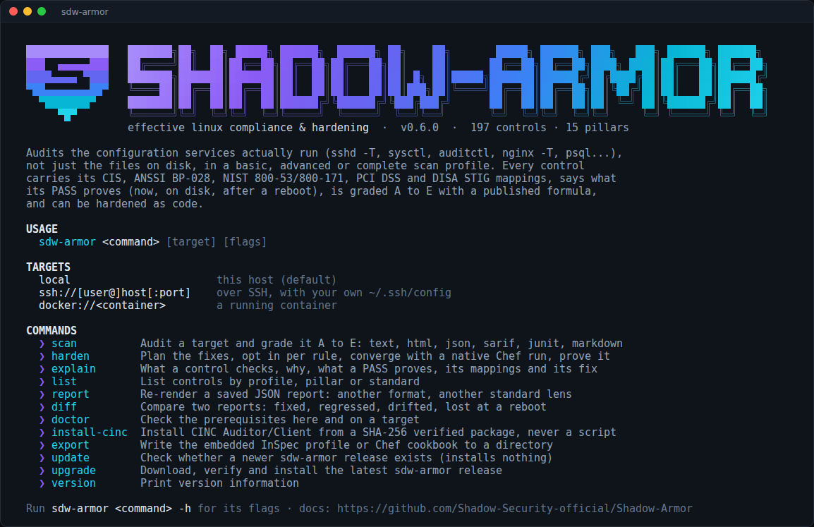
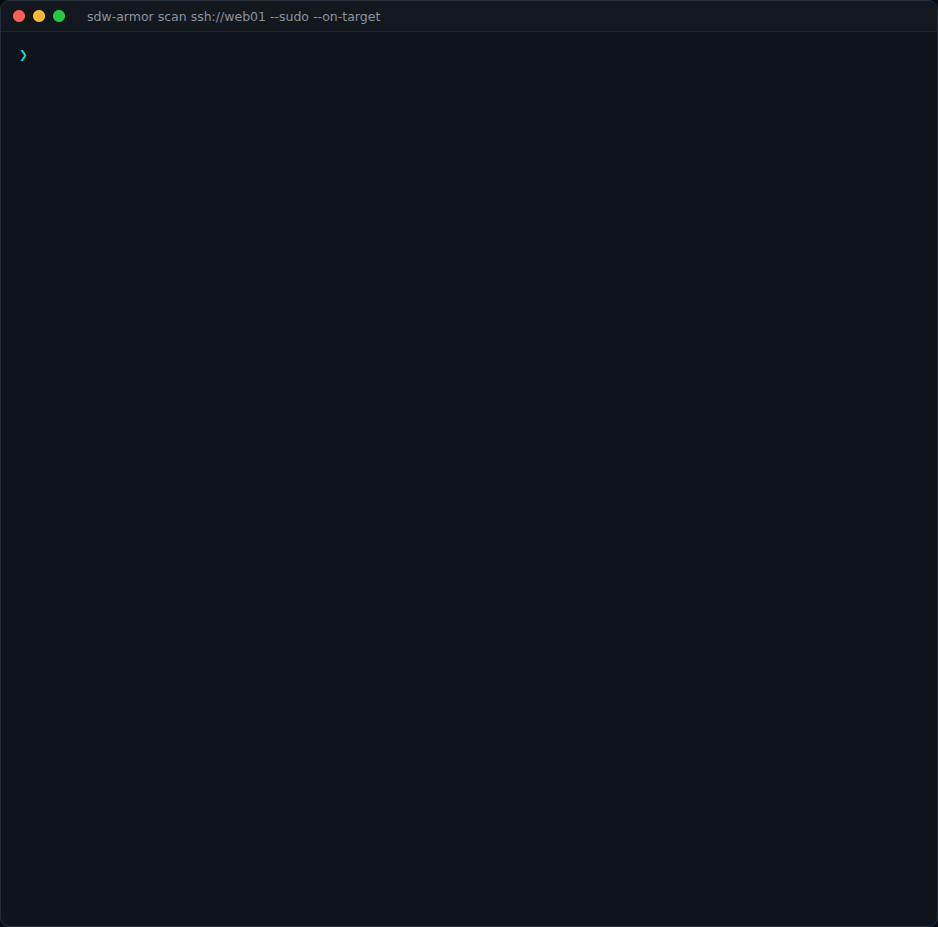
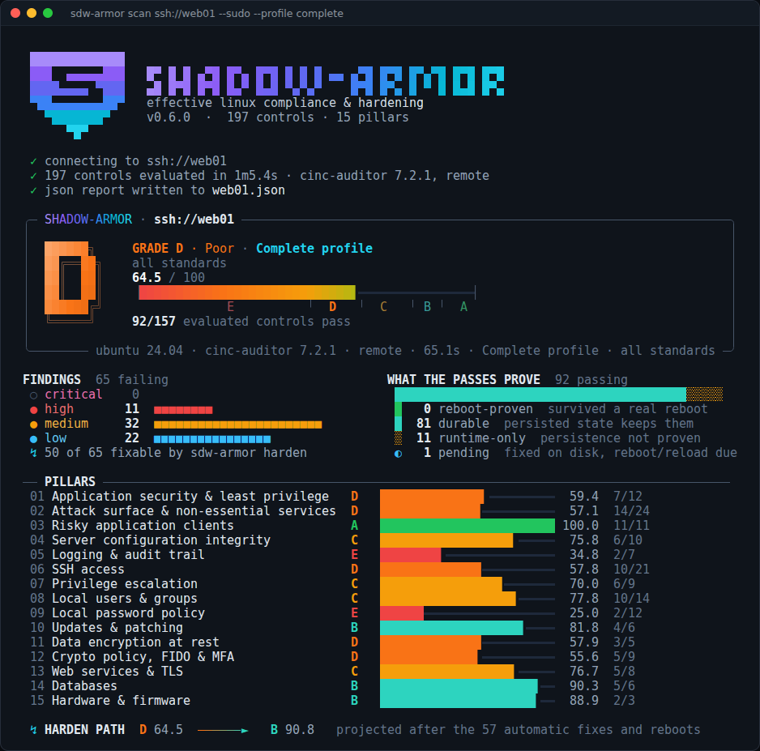
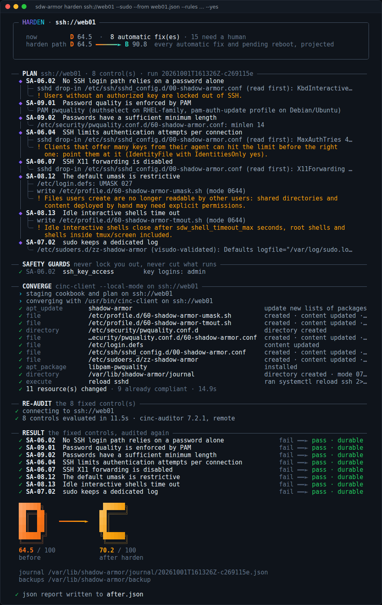
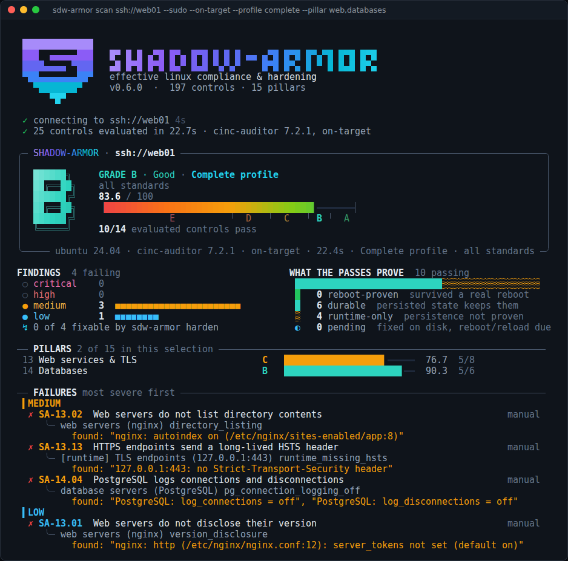
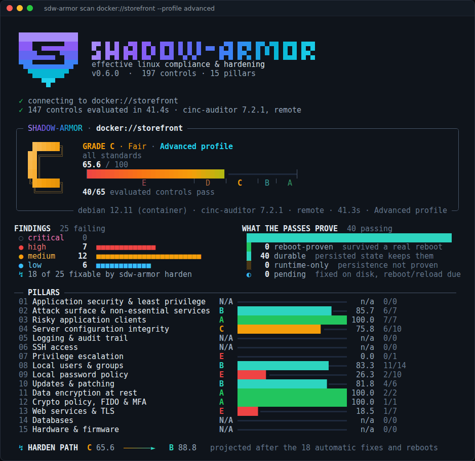
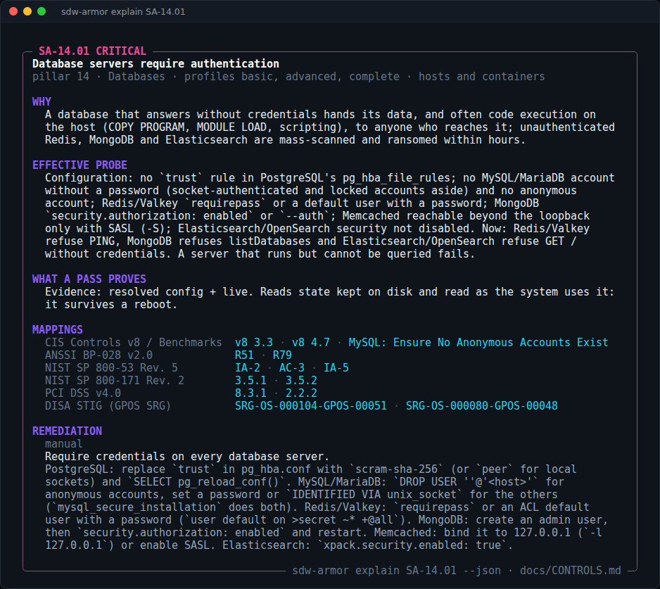
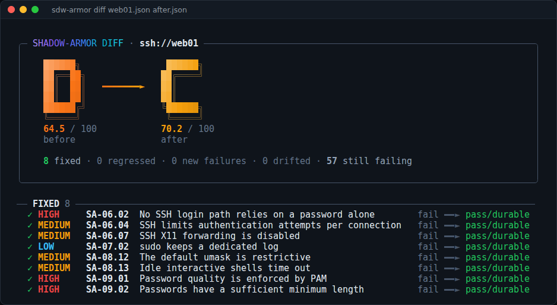

# Shadow-Armor

**Conformité et durcissement Linux sur la configuration effective, avec CINC / InSpec.**

Shadow-Armor audite la configuration que vos services *exécutent réellement* (`sshd -T`, `sysctl`, `auditctl`, `nginx -T`, les `pg_hba_file_rules` de PostgreSQL...), pas seulement le texte des fichiers sur disque. Chaque contrôle porte toutes ses correspondances normatives (CIS, ANSSI BP-028, NIST 800-53 / 800-171, PCI-DSS, DISA STIG), l'hôte reçoit une note de A à E, et le durcissement s'applique « as code ». Un seul binaire statique : `sdw-armor`.

🇬🇧 [English version](README.md)

> [!IMPORTANT]
> **Volontairement draconien.** Les scores Shadow-Armor sont volontairement stricts. Atteindre la note maximale sur une production réelle est quasiment impossible. L'enjeu de cette notation n'est pas de sanctionner une architecture mais de fournir aux équipes une grille d'améliorations claire pour cibler les priorités de sécurité. Un écart assumé (un compte de service qui ne peut pas saisir de mot de passe, par exemple) se déclare dans un [fichier de dérogations](examples/waivers.yml) avec sa justification : il sort de la note et reste listé dans le rapport.

<p align="center"></p>

<p align="center"></p>

<table>
<tr>
<td width="50%"></td>
<td width="50%"></td>
</tr>
<tr>
<td><b>scan</b> : la note, la preuve derrière, chaque pilier, et la note que <code>harden</code> peut atteindre</td>
<td><b>harden</b> : plan, garde-fous, convergence, ré-audit, la note qui bouge</td>
</tr>
<tr>
<td></td>
<td></td>
</tr>
<tr>
<td><b>scan --pillar web,databases</b> : ce que nginx et PostgreSQL servent vraiment, avec le fichier et la ligne</td>
<td><b>scan docker://</b> : un conteneur en cours d'exécution, N/A là où un contrôle d'hôte ne s'applique pas</td>
</tr>
<tr>
<td></td>
<td></td>
</tr>
<tr>
<td><b>explain</b> : pourquoi, comment c'est vérifié, ce que prouve un PASS, toutes les correspondances, la correction</td>
<td><b>diff</b> : corrigé, régressé, dérivé, perdu au redémarrage</td>
</tr>
</table>

## Fonctionnalités

- **La configuration effective, pas les fichiers.** Un contrôle lit l'état résolu : `sshd -T`, valeurs `sysctl` vivantes, `systemctl show`, `auditctl -l`, piles PAM avec tous les `@include` développés, sudoers avec tous les `#includedir`, `modprobe --showconfig`, `systemd-analyze cat-config`, `nginx -T`, l'arbre d'inclusions d'Apache, les `pg_hba_file_rules` de PostgreSQL, les variables globales de MySQL ; chaque port TLS local est sondé tel qu'un client le voit. Il voit les `Include` et drop-ins qu'une lecture de fichier rate (un `50-cloud-init.conf` permissif qui annule une configuration principale plus stricte) et **indique le fichier et la ligne qui fixent la valeur effective**.
- **Un contrôle, toutes ses correspondances.** 197 contrôles neutres, chacun avec ses références CIS Controls v8 et CIS Benchmark, ANSSI BP-028 v2.0, NIST SP 800-53 rév. 5 et SP 800-171, PCI DSS v4.0 et DISA SRG.
- **15 piliers de durcissement**, chacun avec sa note (tableau ci-dessous), du chiffrement des données au repos et des politiques crypto / FIDO / MFA par OTP aux services web et certificats TLS, aux bases de données, et au matériel et firmware sous le noyau.
- **Trois profils de scan.** Chaque scan en exécute un, choisi au lancement (`--profile`, ou une question dans le terminal) : `basic` pour un serveur de développement privé et temporaire, `advanced` pour un serveur privé non exposé, `complete` pour un serveur de production, exposé sur Internet ou exposant des applications critiques. Chaque note est affichée avec son profil.
- **Un verdict qualifié : ce que prouve un PASS.** Chaque verdict porte trois colonnes de preuve, **maintenant · sur disque · après redémarrage**, construites à partir de la nature de l'état lu par chaque assertion (état vivant, configuration de démarrage, configuration résolue, inventaire, fichiers). Un PASS est **durable** ou **runtime-only** (l'état persisté le contredit, ou rien sur disque ne le prouve) ; un FAIL peut être **pending** (déjà corrigé sur disque, en attente d'un redémarrage ou rechargement). La persistance est vérifiée dans le contrôle lui-même partout où elle a une source fiable (sysctl.d, unités activées, modprobe.d, fstab, ligne de commande du noyau, rules.d, pare-feu et MAC au démarrage, lockdown, swap), et un test confronte la nature de preuve déclarée de chaque contrôle à son code. Un A qui repose sur des PASS runtime-only est plafonné à B, et seulement s'il repose dessus : échouer un contrôle ne donne jamais une meilleure note que le réussir.
- **Prouvé par un redémarrage.** Chaque rapport enregistre le démarrage observé. `scan --reboot-baseline avant.json` compare deux scans d'une même machine de part et d'autre d'un vrai redémarrage : ce qui a survécu est **prouvé au redémarrage**, ce qui a disparu est **perdu au redémarrage**. `harden --reboot` enchaîne tout : correction, ré-audit, redémarrage, attente du nouveau démarrage, preuve.
- **Note A:E.** Une [formule publiée](docs/SCORING.md) (pondérée par la sévérité, plafonnée par les contrôles critiques, « fail-closed »), calculée à l'identique par la CLI et le rapport HTML. Une **lentille normative** re-note le même scan à travers un seul référentiel (`--lens anssi`, `--lens pci`...).
- **Le durcissement as code.** `sdw-armor harden` planifie les corrections, vous acceptez règle par règle, des garde-fous écartent toute règle qui vous couperait l'accès ou casserait un service en marche, et une exécution Chef native (`cinc-client --local-mode`) converge des remédiations déclaratives. Les contrôles corrigés sont ensuite **ré-audités**. Dry-run why-run, plans relisables, sauvegarde de chaque fichier modifié, journal de chaque exécution.
- **Rien installé dans votre dos.** `cinc-auditor` s'exécute sur des cibles `local`, `ssh://` ou `docker://` avec votre propre `~/.ssh/config` ; pas d'agent, pas de démon. `--on-target` exige le moteur sur la cible et s'arrête s'il manque. CINC n'est installé que sur demande (`install-cinc`, `--bootstrap-cinc`) : paquet téléchargé sur votre machine, vérifié contre son SHA-256 publié, installé avec `dpkg`/`rpm` ; la cible n'a pas besoin d'Internet, un site isolé fournit son propre paquet.
- **Versions vérifiables.** Binaires statiques, paquets `.deb` et `.rpm`, SBOM CycloneDX (avec l'empreinte du profil InSpec et du cookbook Chef embarqués), provenance SLSA et attestation du SBOM, sommes de contrôle signées avec Sigstore. Aucun module Go tiers.
- **Conteneurs.** Les contrôles propres à l'hôte (noyau, chaîne de démarrage, pare-feu, audit) sont « non applicables » dans un conteneur ; paquets, comptes, SSH, sudo, crypto et correctifs restent évalués. `--input sdw_assume_host=true` évalue tout (conteneurs système type LXC).
- **Sorties.** Terminal, rapport HTML autonome hors-ligne, JSON, SARIF (GitHub code scanning), JUnit et Markdown ; `--fail-under C` bloque un pipeline, `sdw-armor diff --fail-on-regression` détecte la dérive entre deux scans.

## Démarrage rapide

### 1. Installer

Ouvrez [armor.shadow-security.fr](https://armor.shadow-security.fr), choisissez la version, votre système et votre architecture, puis collez la commande proposée : elle télécharge la release, vérifie son SHA-256 (et, si vous cochez l'option, la signature Sigstore avec cosign) et installe `sdw-armor`. Rien n'est passé à un shell, et une empreinte fausse arrête tout avant l'installation.

Téléchargement à la main, paquets `.deb` et `.rpm`, provenance du build (`gh attestation verify`) et SBOM : [docs/INSTALL.md](docs/INSTALL.md).

### 2. Installer le moteur de scan

Shadow-Armor pilote [CINC Auditor](https://cinc.sh/start/auditor/), la version libre de Chef InSpec (Chef InSpec 5+ fonctionne aussi). Il n'est dans aucun dépôt de distribution ; on l'installe depuis un paquet vérifié par SHA-256 :

```sh
sdw-armor install-cinc --sudo        # demande confirmation ; --print affiche les mêmes étapes en commandes shell
sdw-armor doctor                     # moteur, privilèges, et la correction de chaque manque
```

Aucun moteur sur votre machine ? Ajoutez `--engine docker` au scan d'une cible `ssh://` ou `docker://` : CINC Auditor tourne alors depuis son image Docker.

### 3. Scanner

Chaque scan exécute un **profil**, choisi au lancement. Sans `--profile`, `sdw-armor` présente les trois et demande ; sans terminal (CI, cron, script), `--profile` est obligatoire.

| Profil | Contenu | Par exemple |
|---|---|---|
| `basic` (Basique) | les contrôles essentiels : accès distant, comptes, mises à jour, services exposés (41 contrôles) | serveur de développement privé et temporaire |
| `advanced` (Avancé) | les essentiels, plus des contrôles pointus : durcissement du noyau et du réseau, journalisation et audit, politique de mots de passe, intégrité des fichiers, chiffrement (147) | serveur privé non exposé |
| `complete` (Complet) | tous les contrôles, réglages renforcés compris, indépendamment de tout référentiel (197) | serveur de production, exposé sur Internet ou exposant des applications critiques |

```sh
sudo sdw-armor scan                                               # cette machine : demande le profil, puis audite
sudo sdw-armor scan --profile basic                               # sans question
sdw-armor scan ssh://admin@web01 --sudo --profile complete        # en SSH, avec votre ~/.ssh/config
sdw-armor scan ssh://web01 --sudo --profile complete --on-target  # le moteur tourne sur la cible : bien plus rapide
sdw-armor scan docker://mon-app --profile advanced                # un conteneur en marche
sdw-armor scan ssh://web01 --sudo --profile complete -o html:web01.html -o json:web01.json
sdw-armor scan --profile complete --lens anssi                    # noté à travers l'ANSSI BP-028
```

Serveurs web, bases de données et matériel font partie de chaque scan : ils sont audités dès qu'ils sont détectés sur la cible, rien à activer. Shadow-Armor audite la machine qui les fait tourner, de l'intérieur (sa configuration, ses processus, les ports TLS qu'elle écoute), pas une URL depuis l'extérieur ; toutes les cibles conviennent : cette machine, `ssh://` ou `docker://`. Pour ne regarder qu'un pilier :

```sh
sudo sdw-armor scan --pillar web                          # cette machine : nginx, Apache, HAProxy, Caddy, lighttpd, Tomcat, ses ports TLS
sdw-armor scan ssh://db01 --sudo --pillar databases       # PostgreSQL, MySQL/MariaDB, Redis/Valkey, MongoDB, Memcached, Elasticsearch
sdw-armor scan docker://postgres --pillar databases       # un conteneur de base de données
sudo sdw-armor scan --pillar hardware --profile complete  # machine physique : failles CPU, microcode, IOMMU, TPM, BMC, firmware
sdw-armor explain SA-14.01 --fr                           # ce que vérifie un contrôle, pourquoi, et comment corriger
```

### 4. Corriger

```sh
sdw-armor harden ssh://web01 --sudo                                               # demande le profil, audite, puis vous acceptez règle par règle
sdw-armor harden ssh://web01 --sudo --from web01.json --rules SA-06.02,SA-06.04 --dry-run
sdw-armor harden ssh://web01 --sudo --from web01.json --all --plan-out plan.json  # relire d'abord
sdw-armor harden ssh://web01 --sudo --plan plan.json --yes                        # puis appliquer
sdw-armor harden ssh://web01 --sudo --rules SA-05.04,SA-06.02 --reboot            # et prouver que ça survit au redémarrage
```

`harden` a besoin de [CINC Client](https://cinc.sh/start/client/) sur la cible (`sdw-armor install-cinc ssh://web01 --client --sudo`, ou `--bootstrap-cinc`). Avant de converger, `harden` vérifie la cible et écarte toute règle qui vous couperait l'accès (connexion root, mots de passe SSH, su) ou casserait ce qui tourne (pare-feu, routage IP, suppression de paquets) : [docs/HARDENING.md](docs/HARDENING.md). Les réglages des serveurs web, des bases de données et du firmware se corrigent à la main, avec les étapes que donne `sdw-armor explain` : leur configuration est façonnée par leurs équipes, `harden` ne la réécrit pas.

### 5. Mettre à jour

```sh
sdw-armor update          # une version plus récente est-elle publiée ? n'installe rien
sudo sdw-armor upgrade    # télécharge, vérifie (SHA-256, et Sigstore si cosign est installé), installe
```

## Les 15 piliers

| # | Règle | Exemples de contrôles |
|---|---|---|
| 01 | Contrôlez la sécurité et limitez les droits applicatifs | SELinux/AppArmor en enforcing, ASLR, ptrace, eBPF, core dumps, sandboxing systemd, NX |
| 02 | Réduisez la surface d'attaque, désactivez les services non essentiels | serveurs hérités, ports en écoute, modules, sysctl réseau, pare-feu deny par défaut, options de /tmp et /dev/shm |
| 03 | Supprimez les clients applicatifs à risque | telnet, rsh, NIS, FTP/TFTP, netcat -e, compilateurs, forwarding agent/X11 du client SSH |
| 04 | Auditez vos configurations serveurs | AIDE et sa planification, permissions des fichiers sensibles, chargeur de démarrage, cron, Secure Boot, lockdown, fichiers world-writable et orphelins |
| 05 | Activez les logs, première étape vers la conformité | journalisation, journal persistant, auditd et ses règles (chargées *et* persistées), audit immuable, envoi distant, synchronisation horaire |
| 06 | Renforcez la sécurité et la configuration des accès SSH | tout depuis `sshd -T`, blocs Match qui relâchent un paramètre, permissions des configurations et clés d'hôte |
| 07 | Contrôlez l'escalade de privilèges | politique sudo effective, NOPASSWD, use_pty, journal sudo, restriction de su, liste blanche setuid |
| 08 | Contrôlez la configuration des utilisateurs et groupes locaux | UID 0, mots de passe vides, comptes système, homes, dot files, comptes dormants, umask, TMOUT |
| 09 | Appliquez une politique de sécurité des mots de passe | pwquality tel que PAM l'applique, historique, verrouillage, hachage *et empreintes réellement stockées*, nullok |
| 10 | Vérifiez les mises à jour applicatives | correctifs de sécurité en attente, fraîcheur des métadonnées, mises à jour automatiques, signatures, redémarrage dû, bibliothèques supprimées encore en mémoire, version en fin de vie |
| 11 | Chiffrez vos données et les données métier de vos applications | dm-crypt/LUKS sous les montages de données, swap, LUKS2/argon2id, dumps mémoire, clés privées, données applicatives, identifiants utilisateurs |
| 12 | Instaurez des politiques crypto / FIDO / MFA par OTP | politique crypto système, plancher TLS sondé avec OpenSSL, algorithmes SSH, échange de clés post-quantique, MFA SSH (OTP, FIDO2), MFA pour sudo, protection des graines OTP, FIPS |
| 13 | Sécurisez vos services web et vos certificats TLS | nginx (`nginx -T`), Apache (son arbre d'inclusions), HAProxy, Caddy, lighttpd, Tomcat : bannières de version, listage de répertoires, plancher TLS 1.2, workers root, TRACE, pages stats et API d'administration, port d'arrêt, applications manager ; chaque port TLS local sondé pour TLS 1.0/1.1, expiration et taille de clé des certificats, HSTS |
| 14 | Protégez l'accès et la configuration de vos bases de données | PostgreSQL, MySQL/MariaDB, Redis/Valkey, MongoDB, Memcached, Elasticsearch/OpenSearch interrogés tels qu'ils appliquent leurs réglages : authentification (et sonde sans identifiants), SCRAM, TLS sur le réseau, administrateurs distants, local_infile, secure_file_priv, commandes dangereuses, UDP, JavaScript côté serveur, processus root, permissions des répertoires de données |
| 15 | Maîtrisez le matériel, le microcode et le firmware | atténuations des failles CPU et paramètres de démarrage qui les coupent, SMT, microcode, IOMMU, DMA Thunderbolt et FireWire, TPM 2.0, BMC (IPMI cipher 0), mises à jour firmware en attente (fwupd), USBGuard |

La matrice complète est dans [docs/CONTROLS.md](docs/CONTROLS.md). `sdw-armor explain SA-06.17 --fr` détaille n'importe quel contrôle.

## Fonctionnement

```text
            sdw-armor (binaire Go statique, sans dépendance)
 ┌───────────────────────────────────────────────────────────────┐
 │ profil InSpec embarqué ── catalog.json (source unique) ───┐   │
 │ cookbook Chef embarqué                                    │   │
 └──────┬──────────────────────────────────┬─────────────────┼───┘
        │ scan                             │ harden          │ correspondances,
        ▼                                  ▼                 │ entrées, remédiations
 cinc-auditor exec ── local:// ssh:// docker://     cinc-client --local-mode
   (ici, ou sur la cible avec --on-target)            (sur la cible)
        │                                  │
        ▼                                  ▼
 sondes effectives : sshd -T, /proc/sys +  actions déclaratives → ressources natives
 sysctl.d, systemctl, auditctl + rules.d,  (drop-ins, éditions validées, sauvegardes)
 PAM, sudoers, nginx -T, psql, openssl...  → ré-audit des contrôles corrigés
        │
        ▼
 verdicts qualifiés → note A-E → texte · HTML · JSON · SARIF · JUnit · Markdown
```

- **Profil InSpec** (`profile/`) : 197 contrôles dans 15 fichiers (un par pilier), les ressources d'état effectif dans `libraries/`, et `files/catalog.json`, source unique des métadonnées, profils de scan, correspondances, entrées et remédiations. Il fonctionne aussi seul : `sdw-armor export profile ./p && cinc-auditor exec ./p`.
- **Cookbook** (`cookbook/shadow_armor/`) : un petit interpréteur qui transforme les remédiations déclaratives du catalogue en ressources Chef natives.
- **CLI** (`internal/`) : transports vers les cibles (`sh`, le client `ssh` du système, `docker exec`), pilotage du moteur, qualification, notation, rendus, planification du durcissement. Bibliothèque standard uniquement.

## Cibles et modes

| Mode | Commande | Le moteur tourne | Il faut |
|---|---|---|---|
| local | `sdw-armor scan` | ici | cinc-auditor ici, root ou `--sudo` |
| distant | `sdw-armor scan ssh://hote --sudo` | ici, commandes en SSH | cinc-auditor ici ; un accès SSH (votre `~/.ssh/config` s'applique) |
| sur la cible | `sdw-armor scan ssh://hote --sudo --on-target` | sur la cible | cinc-auditor sur la cible (`install-cinc ssh://hote` ou `--bootstrap-cinc` installe un paquet vérifié) |
| conteneur | `sdw-armor scan docker://nom` | ici, via l'API Docker | un accès à Docker |
| moteur Docker | `sdw-armor scan ssh://hote --sudo --engine docker` | ici, dans le conteneur `cincproject/auditor` | Docker seulement, rien d'autre à installer (cibles `ssh://` et `docker://`) |

La plupart des sondes ont besoin de root (`/etc/shadow`, `sshd -T`, `auditctl`, `/proc/*/maps`). Sans lui, elles remontent des **erreurs, comptées comme des échecs** (fail-closed), jamais des réussites silencieuses. sudo est attendu sans mot de passe ; `SDW_SUDO_PASSWORD` est lu quand sudo en demande un.

## Verdicts et note

| Verdict | Signification | Effet sur la note |
|---|---|---|
| `pass` · durable | conforme maintenant, et l'état persisté le maintient après redémarrage (ou un vrai redémarrage l'a prouvé) | réussite |
| `pass` · runtime-only | conforme maintenant, mais l'état persisté le défera, ou rien sur disque ne le prouve | réussite ; un A qui repose dessus est plafonné à **B** |
| `fail` · pending | non conforme maintenant, déjà corrigé sur disque | échec |
| `fail` | non conforme | échec |
| `error` | non évaluable (ex. : pas root) | **échec** |
| `n/a` | non applicable sur cette cible | exclu |
| `waived` | risque accepté (fichier de dérogations InSpec) | exclu, listé |

`score = 100 × Σ poids(réussites) / Σ poids(évalués)`, poids critique 10, élevé 5, moyen 3, faible 1 ; A ≥ 90, B ≥ 80, C ≥ 65, D ≥ 50, E en dessous ; un contrôle critique en échec plafonne la note à D ; un A qui ne tiendrait pas si ses PASS runtime-only échouaient après un redémarrage est plafonné à B. Chaque verdict indique aussi ce qu'il prouve : *maintenant ✓ · sur disque ✓ · après redémarrage ✓ attendu*.

Une note appartient au profil de scan sur lequel elle a été calculée : un A en `basic` ne dit rien du `complete`. Les rapports affichent le profil à côté de la note, et `sdw-armor diff` prévient quand deux rapports n'ont pas le même profil. Détails : [docs/SCORING.md](docs/SCORING.md).

## En CI

```yaml
- name: Audit de l'image candidate
  run: |
    docker run -d --name candidate my-registry/app:${{ github.sha }} sleep infinity
    sdw-armor scan docker://candidate --profile complete -o sarif:shadow-armor.sarif -o json:scan.json --fail-under C
- uses: github/codeql-action/upload-sarif@v3
  if: always()
  with:
    sarif_file: shadow-armor.sarif
- name: Aucune dérive depuis la dernière version
  run: sdw-armor diff baseline.json scan.json --fail-on-regression
```

Codes de sortie : `0` ok, `1` politique non respectée (`--fail-under`, `--fail-on-regression`, échecs restants après `harden`), `2` usage (dont un profil manquant sans terminal), `3` prérequis manquant (moteur, cible injoignable), `4` erreur du moteur.

## Réglages : entrées et dérogations

Les seuils sont des entrées avec des valeurs par défaut documentées (`sdw-armor list --inputs`) :

```sh
sdw-armor scan --input sdw_password_min_length=15 --input sdw_allowed_listening_ports='[22,443]'
sdw-armor scan --input sdw_tls_min_days=45 --input sdw_tls_min_rsa_bits=3072                # certificats des ports TLS locaux
sdw-armor scan --input sdw_mysql_client_options=--defaults-extra-file=/root/.sdw-armor.cnf  # si root ne passe pas par le socket MySQL
sdw-armor scan --inputs examples/policy-pci-dss.json                                        # préréglages : policy-cis, policy-pci-dss, policy-disa-stig
```

Les mêmes valeurs pilotent `harden` : une correction correspond toujours au seuil contre lequel elle a été vérifiée.

Les risques acceptés vont dans un fichier de dérogations InSpec standard ; une dérogation expirée est de nouveau évaluée automatiquement :

```yaml
# waivers.yml
SA-02.19:
  justification: "Filtrage assuré par le security group cloud sg-0abc (SEC-142)"
  expiration_date: 2027-06-30
  run: false
```

```sh
sdw-armor scan ssh://web01 --sudo --waivers waivers.yml
```

## Prérequis

- Cibles Linux : Debian/Ubuntu et la famille RHEL (RHEL, Rocky, Alma, Oracle, CentOS Stream, Fedora, Amazon Linux) sont pleinement prises en charge ; les autres distributions fonctionnent avec les sondes qui s'appliquent.
- Moteur : CINC Auditor ou Chef InSpec 5+ (testé avec CINC Auditor 7.2 et InSpec 5.24). Durcissement : CINC Client 16+ sur la cible.
- S'exécute depuis Linux ou macOS (binaires statiques amd64 et arm64).
- Testé sur Ubuntu 24.04, Debian 12 et Rocky Linux 9 avec CINC Auditor 7.2.1 et CINC Client 19. Systèmes pris en charge et erreurs courantes : [docs/INSTALL.md](docs/INSTALL.md).

## Sécurité et confidentialité

Aucune télémétrie, aucun appel réseau en dehors de vos cibles, d'omnitruck quand vous demandez un paquet CINC, et de GitHub quand vous lancez `update` ou `upgrade`. Les rapports sont écrits en mode `0600`. Le rapport HTML fonctionne hors ligne, avec une Content-Security-Policy par empreintes, et affiche les données scannées uniquement comme du texte. Signaler une vulnérabilité : [SECURITY.md](SECURITY.md).

## Documentation

La documentation détaillée est en anglais :

- [docs/INSTALL.md](docs/INSTALL.md) : téléchargement, vérification (empreintes, provenance, SBOM), le moteur CINC, systèmes pris en charge, erreurs courantes
- [docs/CONTROLS.md](docs/CONTROLS.md) : chaque contrôle, son profil, ce qu'il prouve et ses correspondances
- [docs/SCORING.md](docs/SCORING.md) : natures de preuve, colonnes de preuve, verdicts prouvés au redémarrage, profils de scan et formule A-E
- [docs/HARDENING.md](docs/HARDENING.md) : déroulé du durcissement, garde-fous, ce que change chaque correction, comment revenir en arrière
- [docs/CLI.md](docs/CLI.md) : commandes, options, codes de sortie
- [docs/ARCHITECTURE.md](docs/ARCHITECTURE.md) : comment les pièces s'assemblent, comment ajouter un contrôle
- [examples/](examples/) : préréglages d'entrées par référentiel, un fichier de dérogations, un workflow GitHub Actions
- [CONTRIBUTING.md](CONTRIBUTING.md)

## Licence

Apache 2.0. Copyright © 2026 Shadow Security. Les noms des référentiels appartiennent à leurs propriétaires (CIS®, ANSSI, NIST, PCI SSC, DISA) ; les correspondances sont une aide à la collecte de preuves, pas une certification.
